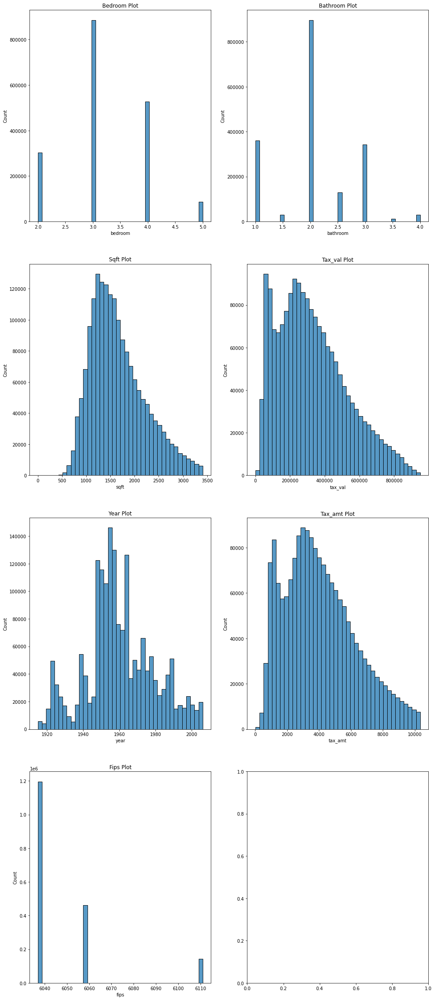

# Acquire & Prep - Wrangle Exercises

# Table of Contents 
1. [Exercise Summary](#exercise_summary)
    1. [Exercise Objectives](#exercise_objectives)
    2. [Deliverables](#deliverables)
3. [Acquire Data](#acquire)
    1. [Data Dictonary](#data_dict)
    2. [Data Description](#data_desc)
    3. [Acquire Takeaways](#acquire_takeaways)
4. [Prepare Data](#prep_data)
    1. [Distributions](#distributions)
    2. [Prepare Takeaways](#prepare_takeaways)

## Exercise Summary

### Exercise Objectives
> - Create a Jupter Notebook report that shows proccesses and analysis with the goal of predicting single-family housing values utilizing data predicated on Zillow 2017 estimations.
> - The data that we are wanting to aquire involves single-family homes from the year 2017.
> - The columns and features we want to aquire are: `bedroomcnt, bathroomcnt, calculatedfinishedsquarefeet, taxvaluedollarcnt, yearbuilt, taxamount, fips`

### Deliverables

> - Store all of the necessary functions to automate your process from acquiring the data to returning a cleaned dataframe with no missing values in your wrangle.py file. Name your final function `wrangle_zillow`.

<a href='#toc'>Table of Contents</a>

## Acquire Data

### Data Dictonary

| Target            | Datatype                  | Definition                 |
|:------------------|:--------------------------|:---------------------------|
| taxvaluedollarcnt | 2152371 non-null: float64 | taxable value for the home |

| Feature                      | Datatype                  | Definition                                    |
|:-----------------------------|:--------------------------|:----------------------------------------------|
| bedroomcnt                   | 2152853 non-null: float64 | quantifies the number of bedrooms in a house  |
| bathroomcnt                  | 2152853 non-null: float64 | quantifies the number of bathrooms in a house |
| calculatedfinishedsquarefeet | 2144379 non-null: float64 | quantifies the calculated number of sq ft.    |
| taxvaluedollarcnt            | 2152371 non-null: float64 | taxable value for the home                    |
| yearbuilt                    | 2143526 non-null: float64 | defines the year that the home was built      |
| taxamount                    | 2148422 non-null: float64 | quantifies the amount of taxes the home pays  |
| fips                         | 2152864 non-null: float64 | Federal state code                            |

### Data Description

> - There are 2,152,864 observations and 7 attributes/features within this dataset.

|                              |       count |         mean |           std |     min |       25% |       50% |      75% |              max |
|:-----------------------------|------------:|-------------:|--------------:|--------:|----------:|----------:|---------:|-----------------:|
| bedroomcnt                   | 2.15286e+06 |      3.28719 |      0.954754 |    0    |      3    |      3    |      4   |     25           |
| bathroomcnt                  | 2.15286e+06 |      2.23069 |      0.999278 |    0    |      2    |      2    |      3   |     32           |
| calculatedfinishedsquarefeet | 2.15286e+06 |   1862.86    |   1219.71     |    1    |   1259    |   1626    |   2204   | 952576           |
| taxvaluedollarcnt            | 2.15286e+06 | 461896       | 699596        |    1    | 188216    | 327672    | 534455   |      9.84289e+07 |
| yearbuilt                    | 2.15286e+06 |   1960.95    |     22.1141   | 1801    |   1949    |   1958    |   1975   |   2016           |
| taxamount                    | 2.15286e+06 |   5634.86    |   8170.47     |    1.85 |   2538.28 |   4116.19 |   6406.9 |      1.33776e+06 |
| fips                         | 2.15286e+06 |   6048.38    |     20.4333   | 6037    |   6037    |   6037    |   6059   |   6111           |

> - There are numerous null values within many of the columns that will need to be rectified.

|                              |Count_of_nulls|
|:-----------------------------|-----:|
| bedroomcnt                   |   11 |
| bathroomcnt                  |   11 |
| calculatedfinishedsquarefeet | 8485 |
| taxvaluedollarcnt            |  493 |
| yearbuilt                    | 9338 |
| taxamount                    | 4442 |
| fips                         |    0 |

### Acquire Takeaways

> - It appears that there are many null values in `yearbuilt`, `calculatedfisnishedsquarefeet`, and `taxamount`
> - Utilizing the mean would be helpful in filling these null values.

<a href='#toc'>Table of Contents</a>

## Prepare Data

### Distributions
> - Examine the distributions of each column, however there are many observations that could be considered outliners, such as a `taxvaluedollarcnt` of 
> - The columns naming conventions could be easier to understand with a simple rename.
> - Since we are trying to predict the home's value, we can't use `taxamount` due to that being predicated on the house's value. 
> - The `fips` and `yearbuilt` columns would be considered categorical data, due to them representing a geographic or time location, so changing the data type to a object would be better.
> - There are numerous null values within multiple columns, so using the mean for each column is the method we are using to fill the null values

### Prepare Takeaways

> - Upon initial investigation we can see that most of the `tax_val` is around the 250-300k range without the outliers 

<a href='#toc'>Table of Contents</a>

